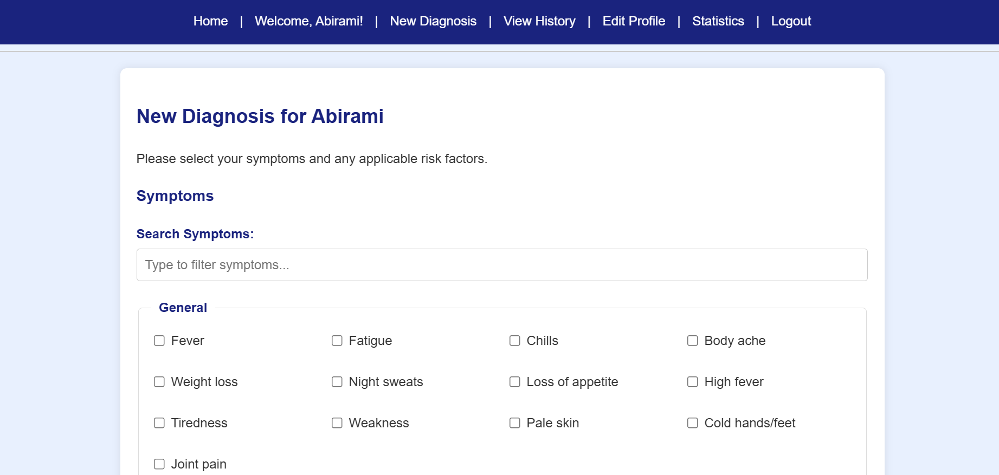
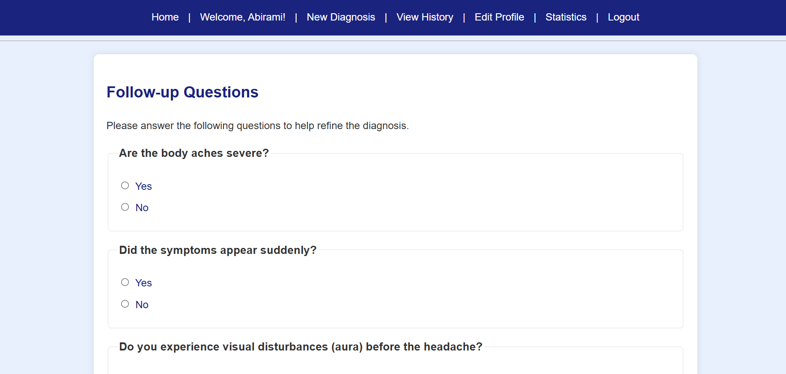
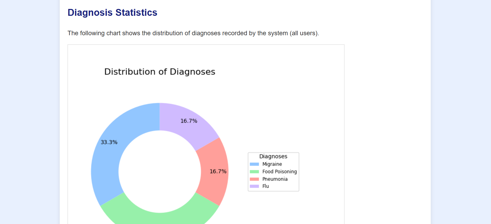

# 🧠 MedRule: Rule-Driven Diagnosis Expert System

MedRule is an intelligent expert system that helps users **diagnose common diseases** based on reported symptoms. It integrates **Prolog-based rule inference**, a **Flask-based web interface**, and **PDF reporting** to offer a comprehensive diagnostic experience.

> ⚠️ **Disclaimer**: MedRule provides potential diagnoses for informational purposes only. It is not a substitute for professional medical advice.

---

## 🚀 Features

- 🔎 **Expert System with 20+ Diseases**: Diagnoses include symptoms, severity, causes, and treatments.
- 🎯 **Weighted Symptom Matching**: Confidence scores based on symptom weight.
- 🧠 **Smart Follow-up Questions**: Dynamic refinement through targeted questioning.
- ⚕️ **Risk Factor Analysis**: Considers pre-existing conditions and risk factors.
- 💬 **Personalized Advice**: Health suggestions tailored to user profiles.
- 💊 **Treatment Plans**: Suggestions for home remedies and medical treatment.
- 🧪 **Test Recommendations**: Proposes relevant medical investigations.
- 🚦 **Severity Classification**: Labels diagnoses as mild, moderate, or severe.
- 🕒 **Patient History Tracking**: All reports stored for future reference.
- 📄 **PDF Report Generation**: Downloadable diagnostic summaries.
- 🔐 **User Authentication**: Register and log in securely.
- 🌐 **Web-based UI**: Flask app for browser-based interaction.

---

## 🧰 Technology Stack

### 📦 Backend
- **Prolog**: Knowledge base and inference engine (`Diagnosis.pl`)
- **Python 3.x**: Core logic
- **pyswip**: Python–Prolog bridge
- **Flask**: Web framework
- **sqlite3**: For storing users and history (can be upgraded to MongoDB)
- **FPDF**: PDF report generation

### 💻 Frontend
- HTML/CSS/JS (via Flask templates)

---

## 📸 Screenshots

### 📝 New Diagnosis


### ❓ Follow-up Questions


### 📊 Diagnosis Result


### 📈 Statistics


### 📂 History


---

## 🔧 Installation and Setup

### ✅ Prerequisites
- Python 3.x
- SWI-Prolog (required for `pyswip`)
- pip (Python package manager)

### 📥 Installation Steps

1. **Clone the repository**
   ```bash
   git clone https://github.com/your-username/MedRule.git
   cd MedRule
Install Python dependencies

bash
Copy
Edit
pip install -r requirements.txt
Your requirements.txt should include:

nginx
Copy
Edit
Flask
pyswip
fpdf
Install SWI-Prolog

Download from SWI-Prolog Website

Ensure it is added to your system's PATH

Run the application

bash
Copy
Edit
python app.py
Access the app

Open your browser and go to: http://127.0.0.1:5000

🧬 Usage Instructions
Register/Login to the app.

Enter your symptoms (e.g., "fever, cough, fatigue").

Answer follow-up questions for more accurate results.

Get diagnosis with:

Confidence Score

Suggested Tests

Treatment Recommendations

Personalized Health Advice

Download PDF Report

View Past Diagnoses in History

🗂️ Project Structure
php
Copy
Edit
MedRule/
│
├── app.py                   # Main Flask application
├── Diagnosis.pl             # Prolog expert system rules
├── templates/               # HTML templates
├── static/                  # CSS, JS, images
├── reports/                 # Generated PDF reports
├── medrule.db               # SQLite database (auto-created)
└── requirements.txt         # Python dependencies
📈 Future Enhancements
🔄 Switch to MongoDB for flexible storage

💊 Comorbidity Warnings for overlapping conditions

⏱️ Recovery Time Predictions

🤖 AI/ML integration for symptom prediction

📱 Mobile-Responsive UI

🧾 Feedback Loop to improve rules based on user input

🔍 Interactive Symptom Input (autocomplete, dropdowns)

📜 License
This project is licensed under the MIT License.

🙋‍♀️ Questions or Feedback?
Open an issue or contact the maintainer via GitHub.

yaml
Copy
Edit

---

Let me know if you want me to:
- Turn this into a downloadable `.md` file
- Help host your screenshots or video
- Add a real YouTube demo embed

Would you like a README with GitHub badge icons too (build passing, license, etc.)?


