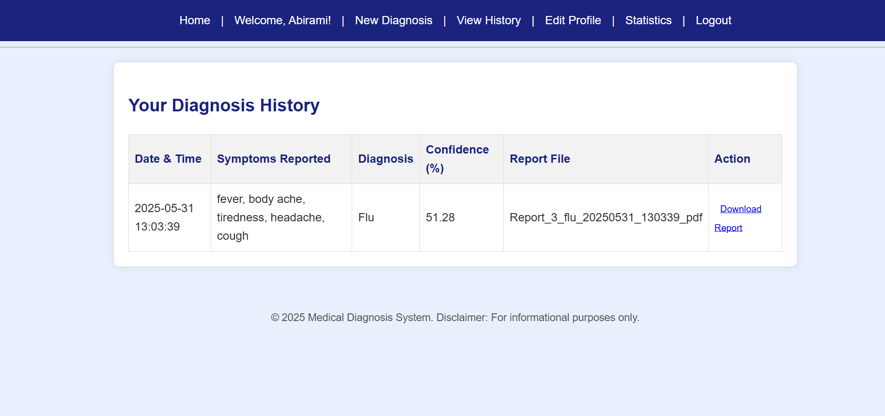

MedRule: Rule-Driven Diagnosis Expert System
Overview
MedRule is an intelligent expert system designed to assist users in diagnosing common diseases based on reported symptoms. It leverages Prolog for its sophisticated rule-based knowledge base, interacts with users via a Python application, and stores patient diagnosis history. The system aims to provide preliminary insights into potential health conditions, suggest treatments, recommend tests, and offer personalized advice.

Features
Extensive Knowledge Base: Contains facts and rules for over 20 common diseases, including symptoms, severity levels, causes, and treatments.
Weighted Symptom Matching: Diagnoses diseases by calculating confidence scores based on the weight of matched symptoms.
Dynamic Follow-up Questions: Refines diagnostic accuracy by asking targeted questions based on initial symptom matches.
Risk Factor Integration: Incorporates user-reported risk factors to further influence diagnosis confidence.
Personalized Advice: Offers tailored health advice based on a user's pre-existing medical conditions.
Treatment Suggestions: Provides comprehensive treatment plans for identified diseases.
Test Recommendations: Suggests relevant medical tests for confirmed diagnoses.
Severity Classification: Categorizes diseases into mild, moderate, or severe to guide urgency of medical consultation.
Patient History Tracking: Stores a history of diagnoses for future reference and analysis.
PDF Report Generation: Creates detailed, downloadable PDF reports of each diagnosis, including patient info, symptoms, diagnosis, treatment, and advice.
User Authentication: Secure user registration and login system.
Web-based Interface: A user-friendly web application built with Flask for easy interaction.
Technologies Used
Prolog: For the expert system's knowledge base and inference engine (Diagnosis.pl).
Python 3.x: For the main application logic, user interface (Flask), and interaction with Prolog.
pyswip: Python-Prolog bridge for querying the knowledge base.
Flask: Web framework for the user interface.
FPDF: Library for generating PDF reports.
sqlite3: (Default for history storage in provided code) For storing user and diagnosis history. Note: The project AIM mentions MongoDB, but the current Python implementation uses SQLite. This can be adapted if MongoDB is preferred.
Installation and Setup
Prerequisites
Python 3.x
SWI-Prolog (or another compatible Prolog interpreter, ensuring pyswip compatibility)
Steps
Clone the repository:

Bash

git clone https://github.com/your-username/MedRule.git
cd MedRule
Install Python dependencies:

Bash

pip install -r requirements.txt
(You'll need to create a requirements.txt file if you don't have one. It should contain: Flask, pyswip, fpdf)

Ensure SWI-Prolog is installed and configured:

pyswip requires a working SWI-Prolog installation accessible from your system's PATH.
Download and install from SWI-Prolog website.
Database Setup:
The application uses an SQLite database for user management and diagnosis history. This database will be created automatically on the first run if it doesn't exist.

Run the application:

Bash

python app.py
Access MedRule:
Open your web browser and navigate to http://127.0.0.1:5000 (or the address displayed in your console).

Usage
Register/Login: Create a new account or log in if you're an existing user.

Enter Symptoms: On the diagnosis page, input your symptoms. Use clear, descriptive words.

Answer Follow-up Questions: The system may ask specific questions to refine the diagnosis.

View Diagnosis: Receive a potential diagnosis with a confidence score, recommended tests, suggested treatments, and general/personalized advice.

Generate Report: Download a PDF report of your diagnosis for your records.

View History: Access your past diagnosis reports from your user history.

Project Structure

app.py: Main Flask application file, handling routing, user interaction, database operations, and calls to Prolog.

Diagnosis.pl: The Prolog knowledge base containing all disease definitions, rules, treatments, and advice.

templates/: HTML templates for the web interface (e.g., welcome.html, login.html, register.html, diagnose.html, history.html, report.html).

static/: Contains static files like CSS, JavaScript, and images.

reports/: (Created by app.py) Directory where generated PDF diagnosis reports are saved.

medrule.db: (Created by app.py) The SQLite database file for user and history data.

Future Enhancements (Potential)

MongoDB Integration: Replace SQLite with MongoDB for patient records as per the original AIM.

Comorbidity Alerts: More sophisticated rules to explicitly warn about interactions between diagnosed conditions and pre-existing medical conditions.

Recovery Time: Integrate recovery time predictions for diseases in the knowledge base and reports.

Interactive Symptom Input: Implement a more guided symptom input, perhaps with autocomplete or predefined symptom lists.

Machine Learning Integration: Explore integrating ML models for symptom analysis or prediction, complementing the rule-based system.

User Feedback Loop: Allow users to provide feedback on diagnoses to improve the system over time.

Mobile Responsiveness: Enhance the web interface for better usability on mobile devices.

Screenshots of MedRule:

Disclaimer

MedRule provides potential diagnoses based on reported symptoms and is not a substitute for professional medical advice. Always consult a qualified healthcare provider for any health concerns or before making any decisions related to your health or treatment.

